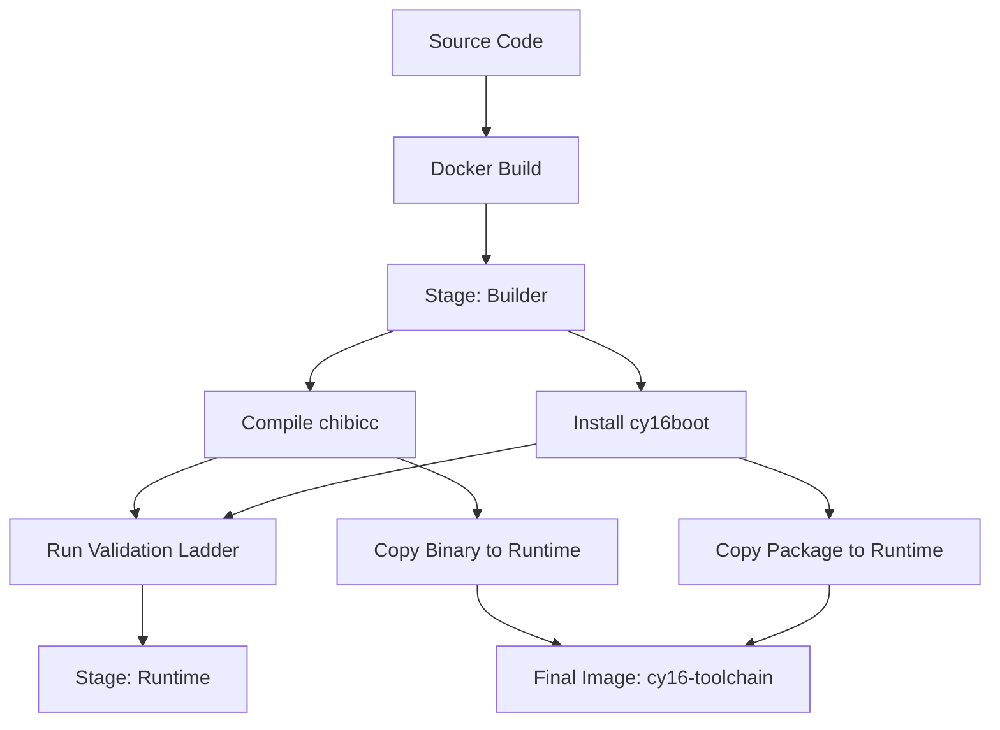

# CY16 Containerization Strategy

This document outlines the strategy for moving the CY16 build and execution environment into a containerized workflow based on Debian Trixie.

## 1. Objectives
*   **Isolation:** Ensure the toolchain build is reproducible and independent of the host OS (especially important given the Windows/Linux mix in the current environment).
*   **Minimalism:** Use a "slim" base image and only install required packages.
*   **Efficiency:** Use multi-stage builds to keep the final toolchain image small.

## 2. Container Definitions

### A. Build Container (`builder`)
*   **Base:** `debian:trixie-slim`
*   **Purpose:** Compiles the `chibicc` C compiler, installs Python dependencies, and executes the full validation ladder.
*   **Software Stack:**
    *   `gcc`, `make`, `libc6-dev`: For building the compiler.
    *   `python3`, `python3-pip`: For running the assembler, disassembler, and simulator.
    *   `pycparser`, `pytest`: For the validation suite.

### B. Runtime Container (`runtime`)
*   **Base:** `debian:trixie-slim`
*   **Purpose:** Provides a lightweight environment for compiling C code to CY16 assembly and running simulations.
*   **Software Stack:**
    *   `python3`, `python3-minimal`.
    *   The built `cy16-cc` binary.
    *   The `cy16boot` Python package.
*   **Artifacts:**
    *   `/usr/local/bin/cy16-cc` (The C compiler).
    *   `cy16-as`, `cy16-dis`, `cy16-sim` (Python CLI tools).

## 3. Implementation Workflow
1.  **Dockerfile:** Create a multi-stage `Dockerfile`.
2.  **Volume Mapping:** Design the execution command to map the local `examples/` or project directory into the container's `/work` directory.
3.  **CI Integration:** Update GitHub Actions to use the `builder` stage for verification.

## 4. Sequencing Diagram

