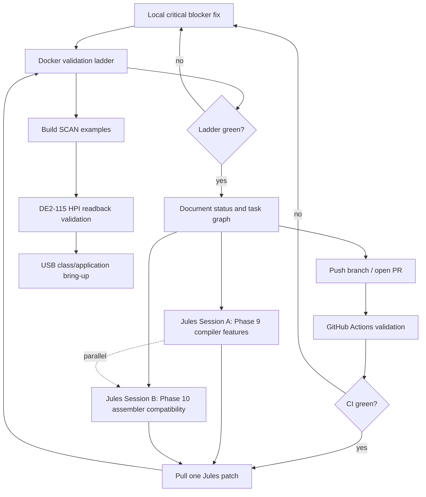

# CY16 Bring-Up Orchestration Plan

Last updated: 2026-05-11

## Current status

Milestones 1 through 8 are complete enough for the current bring-up ladder:

- Assembler, disassembler, simulator, and SCAN tools exist and have golden tests.
- The chibicc-derived CY16 backend emits assembly for the v0 subset plus the validated Phase 9 baseline for structs, arrays, pointer arithmetic, switch/case, and spilled parameter registers.
- Minimal headers, libcy16 seeds, and DE2-115 handoff documentation are present.
- Docker now builds the Linux validation image and runs the current validation ladder successfully.

Latest local verification:

```text
docker build -t cy16-ladder .
```

Result: `23 passed` in the Python test suite, setup-stub disassembly/simulation ran, and the image built successfully.

GitHub Actions validation:

- PR: https://github.com/mark-e-deyoung/CY16-bootstrap/pull/1
- Branch: `main`
- Merge commit: `e8414ff208d7384368ebd7baa684e75b5732e17a`
- Green baseline run before this handoff: `25635202946`
- Result: success

## Completed in this orchestration pass

The previous blocker was `test_compiler_ptr_arith`. It exposed several sequential backend issues:

1. `ND_COMMA` was missing in `gen_expr`.
2. chibicc emitted `ND_MEMZERO` for initialized locals.
3. local variables were being mistaken for register-mapped parameters because default local offsets started at zero.
4. pointer scaling introduced constant `ND_MUL` nodes.
5. the backend double-scaled pointer arithmetic after chibicc had already lowered indexes to byte offsets.
6. `ND_NULL_EXPR` expression statements popped the stack without a matching push, corrupting local storage.

Those issues were fixed locally in `src/cy16cc/cy16_codegen.c`.

## Task relationships

The bring-up ladder is sequential at the validation boundary:

```text
C frontend/backend
  -> CY16 assembly
  -> cy16-as
  -> cy16-dis
  -> cy16-sim
  -> cy16-scanwrap / cy16-scan-decode
  -> DE2-115 HPI loader
  -> CY7C67200 hardware behavior
```

Compiler backend fixes must complete before assembler/simulator validation is meaningful for generated code. SCAN packaging depends on a correct raw payload. Hardware HPI work depends on SCAN images that decode cleanly and, for hardware-independent examples, run in the simulator.

## Delegation model

### Must be local

- Critical-path fixes that are blocking the current ladder, especially when each failure exposes the next failure.
- Repository state management, generated artifact cleanup, and final integration.
- Any hardware run requiring the local DE2-115, Quartus, SignalTap, USB capture, or CY7C67200 physical access.

### Good Jules tasks

Use Jules for bounded follow-on implementation on isolated source areas after the current tree is green:

- Phase 9 compiler features in `src/cy16cc/`: `switch/case`, static locals, function pointers, interrupt attribute, inline asm.
- Focused assembler compatibility in `src/cy16boot/asm.py` and `src/cy16boot/dis.py`: `.ascii`, `.bss`, legacy register spelling, and listing compatibility.
- Test expansion for compiler edge cases, as long as Jules is told not to touch hardware docs or generated binaries.

Jules work should be pulled only after the local Docker ladder is green, then merged one session at a time with the full ladder rerun between sessions.

### Good GitHub Actions tasks

- Full Linux validation on pushed branches and PRs.
- Regression matrix for independent Python tools and C backend build.
- Artifact-producing CI for `.bin`, `.scan`, listing, and map outputs from examples.

GitHub Actions is validation delegation, not implementation delegation. It should run after local changes or Jules patches are pushed.

## Parallelism and sequencing

Parallelizable:

- Jules compiler feature work and Jules assembler compatibility work can run in parallel because their primary write sets are separate.
- GitHub Actions can validate a pushed branch while local planning or hardware preparation continues.
- Documentation updates can proceed in parallel with remote feature sessions as long as they do not claim unverified results.

Sequential:

- Local critical blocker fixes must precede CI validation.
- Jules patches must be applied one at a time, with the ladder run after each patch.
- Hardware HPI/USB debugging must wait until compiler, assembler, simulator, and SCAN packaging pass for the target image.
- If HPI readback still returns `0x0000`, fix HPI electrical/protocol readback before USB class debugging.

## Sequencing diagram



## Current delegation state

- GitHub CLI auth is working for `mark-e-deyoung`; PR validation is active.
- `jules` works when the broken proxy environment variables are cleared for the process. The persistent environment currently points `HTTP_PROXY`, `HTTPS_PROXY`, `ALL_PROXY`, `GIT_HTTP_PROXY`, and `GIT_HTTPS_PROXY` at `127.0.0.1:9`.

## Active Jules sessions

- Phase 10 assembler/disassembler compatibility: https://jules.google.com/session/2129117754108276796 (`Completed` as of latest poll). The compatible subset has been locally reviewed, integrated, and validated: `%rN` spelling, stack forms, string directives, `.space`/`.skip`, `.bss` section markers, docs, and tests.
- Phase 9 compiler follow-on: https://jules.google.com/session/12196061178148043562 (`Awaiting User Feedback` as of latest poll). The pulled patch was not applied because it included a generated `chibicc` binary patch. The useful switch/case work was reimplemented locally with simulator-backed tests.

Older Jules sessions remain in the account but should be treated as superseded unless their exact diff is intentionally reviewed. These sessions were created against `mark-e-deyoung/CY16-bootstrap`, not the uncommitted local workspace. Integrate one session at a time on top of green `main`.

## Recommended next actions

1. Keep `main` as the green baseline and do not include the local `test.c` scratch change in handoff commits.
2. Push and confirm GitHub Actions for the integrated Phase 10 assembler/disassembler compatibility work.
3. Continue Phase 9 with static locals, function pointers, interrupt attributes, inline assembly, and peephole cleanup as separate changes.
4. Rerun the full ladder after each Phase 9 feature, then generate SCAN examples and move to DE2-115 HPI readback validation.
