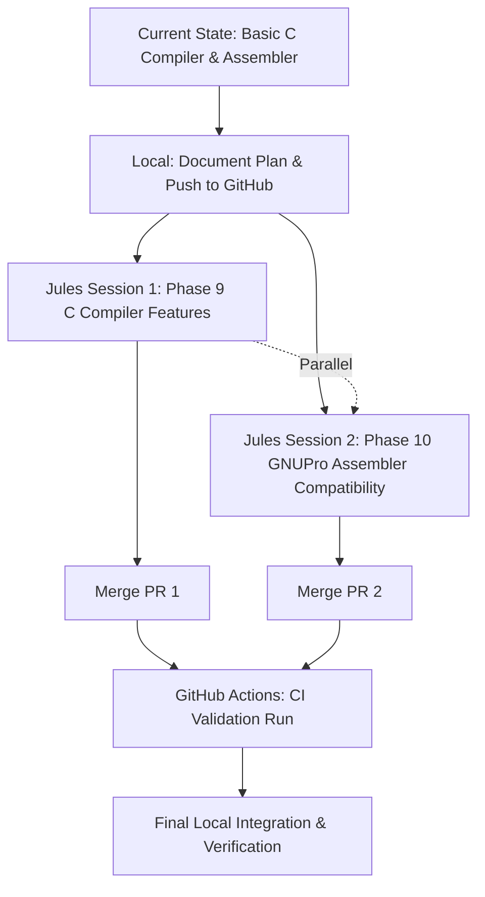

# CY16 Bring-Up Orchestration Plan

## 1. Findings
We have successfully completed Milestones 1 through 8.
*   **Assembler & Disassembler:** We have a working, data-driven ISA and an assembler/disassembler capable of round-tripping CY16 instructions, including conditional jumps, ALU operations, and memory addressing.
*   **Simulator:** `cy16-sim` is fully functional with register tracking, memory mapping (e.g., MMIO simulation), and flag evaluation (Z, C, S, O).
*   **Compiler Backend:** The `chibicc` C-based backend (`src/cy16cc/cy16_codegen.c`) has been successfully ported to CY16 assembly. It supports basic arithmetic, loops, structs, and stack-based local variables.
*   **CI/CD:** GitHub Actions is configured to build the C compiler and run the full validation ladder on every commit.

## 2. Next Steps (Phases 9 & 10)
The focus shifts to completing **Phase 9 (v1 Compiler Features)** and initiating **Phase 10 (GNUPro Compatibility)**.

*   **Phase 9:** Implement `switch/case` statements, static locals, function pointers, and inline assembly in the C compiler backend.
*   **Phase 10:** Enhance the Python assembler (`src/cy16boot/asm.py`) and disassembler (`dis.py`) to support legacy GNUPro syntax (e.g., `.ascii`, `.bss`, legacy register naming conventions).

## 3. Delegation Strategy

### Local Execution (Gemini CLI)
*   **Task:** Define the orchestration plan, manage repository state, and perform final integration testing.
*   **Reasoning:** Centralized oversight is required to ensure parallel delegations do not conflict and that the validation ladder remains unbroken.

### GitHub Actions (Delegated CI)
*   **Task:** Automate the Validation Ladder.
*   **Reasoning:** Ensures that asynchronous changes from Jules agents do not introduce regressions. Operates sequentially after any push or PR merge.

### Google Jules (Delegated Refactoring/Feature Implementation)
*   **Task A (Jules Session 1):** Implement Phase 9 features (`switch/case`, `static` locals, function pointers) in `src/cy16cc/cy16_codegen.c`.
    *   **Status:** Active. Session ID: `7016060761375672113`.
    *   **URL:** https://jules.google.com/session/7016060761375672113
    *   **Reasoning:** Heavy C/AST manipulation. Highly isolated to the compiler frontend/backend bridge.
*   **Task B (Jules Session 2):** Implement Phase 10 GNUPro compatibility in `src/cy16boot/asm.py` and `src/cy16boot/dis.py`.
    *   **Status:** Active. Session ID: `12822227189761318531`.
    *   **URL:** https://jules.google.com/session/12822227189761318531
    *   **Reasoning:** Python string parsing and regex manipulation. Highly isolated to the assembler toolchain.

## 4. Task Relationships & Sequencing
*   **Parallel Execution:** Task A (C Compiler) and Task B (Python Assembler) can run in **parallel**. They modify completely independent subsystems (`src/cy16cc/` vs `src/cy16boot/`).
*   **Sequential Constraint:** Task B's assembler changes must remain backward-compatible with the output generated by Task A. The final end-to-end validation requires both to be merged sequentially.

## 5. Sequencing Diagram

## 6. Execution Plan
1.  **Done:** Update this Orchestration Plan with Phase 9 & 10 details.
2.  **Done:** Commit and push the updated plan to GitHub.
3.  **Done:** Spawn Jules Session 1 for Phase 9 C Compiler features.
4.  **Done:** Spawn Jules Session 2 for Phase 10 Assembler features.
5.  **In Progress:** Monitor Jules sessions, apply patches, and verify locally.

## 7. Current Handoff Status
* **Containerization:** A multi-stage Dockerfile and a PowerShell helper (`scripts/run_docker.ps1`) are implemented and pushed to the repository.
* **Build Status:** The Docker build is currently failing during the validation ladder on `test_compiler_ptr_arith`. The C backend (`cy16_codegen.c`) is missing support for `ND_COMMA` (Node kind 18) and potentially other nodes required for variable initialization in pointer arithmetic testing.
* **Active Jules Sessions:**
  * Session 1 (Phase 9 C Compiler Features): https://jules.google.com/session/7016060761375672113
  * Session 2 (Phase 10 GNUPro Assembler): https://jules.google.com/session/12822227189761318531
* **Next Actions:**
  1. Fix the `ND_COMMA` omission and any other remaining missing nodes in `src/cy16cc/cy16_codegen.c` (`gen_expr`).
  2. Complete the Docker build and verify the validation ladder runs cleanly.
  3. Wait for the active Jules sessions to complete and merge their changes.
