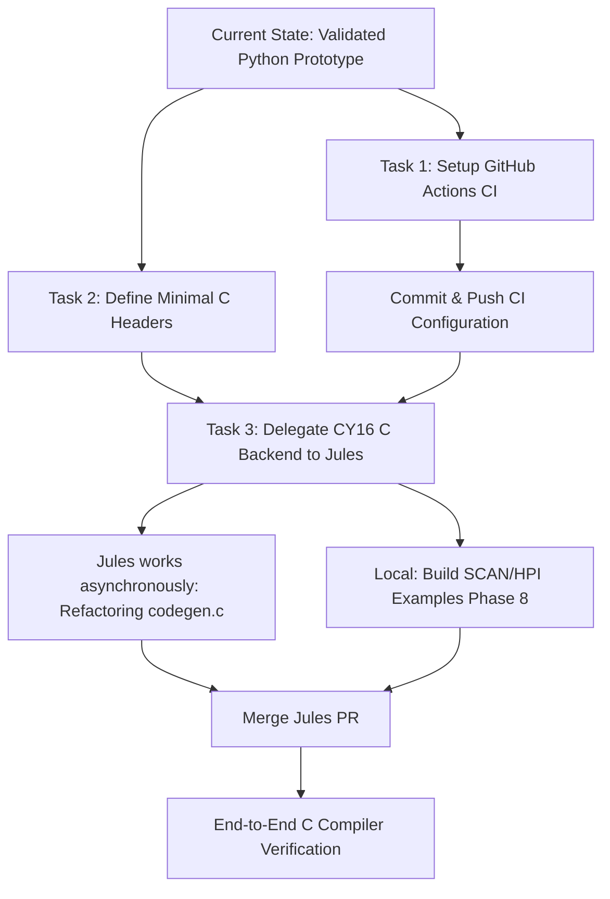

# CY16 Bring-Up Orchestration Plan

## 1. Findings
We have successfully completed Milestones 1 through 4 (Phases 1-3 of the POAM).
*   **Assembler & Disassembler:** We have a working, data-driven ISA and an assembler/disassembler capable of round-tripping CY16 instructions, including conditional jumps, ALU operations, and memory addressing.
*   **Simulator:** `cy16-sim` is fully functional with register tracking, memory mapping (e.g., MMIO simulation), and flag evaluation (Z, C, S, O).
*   **Prototype Compiler:** A Python-based `cy16cc` compiler prototype was written using `pycparser`. It successfully lowers C constructs (addition, memory reads, while loops, calls) to CY16 assembly, proving the viability of the instruction set.
*   **Real Binaries:** We identified the Cypress `scanwrap.c` "setup stub" and SCAN image headers as our primary golden fixtures.

## 2. Next Steps (The Bring-Up Ladder)
The next major objective is to transition from the Python prototype compiler to the actual C-based compiler using the vendored `chibicc` source. This corresponds to POAM Phases 4-7.

## 3. Delegation Strategy

### Local Execution (Gemini CLI)
*   **Task:** Define the orchestration plan, orchestrate execution, and maintain the repository state.
*   **Task:** Setup Phase 7 Minimal Headers (`include/stdint.h`, `include/stddef.h`, etc.) and `libcy16` runtime startup stubs.
*   **Reasoning:** These are foundational files that define the ABI and environment constraints. They require precise alignment with the CY16 documentation.

### GitHub Actions (Delegated CI)
*   **Task:** Automate the Validation Ladder.
*   **Reasoning:** GitHub Actions is perfectly suited for running our established tests (`pytest`, `cy16-as`, `cy16-dis`, `cy16-sim`, `cy16-scanwrap`) on every commit. This ensures that large-scale changes to the compiler frontend do not break the proven backend validation.

### Google Jules (Delegated Refactoring/Porting)
*   **Task:** Port `src/cy16cc` (chibicc) to emit CY16 assembly.
*   **Status:** Active. Session ID: `15245112921042408519`.
*   **URL:** https://jules.google.com/session/15245112921042408519
*   **Reasoning:** Jules excels at large-scale, multi-file refactoring. Converting the C-based x86-64 code generator (`codegen.c`) to a CY16 backend (`cy16_codegen.c`) is a substantial, highly context-dependent task. Jules can analyze the existing C codebase and replace the backend emission logic in parallel while local work continues.

## 4. Sequencing Diagram

## 5. Execution Plan
1.  **Done:** Write `.github/workflows/ci.yml` to run the validation ladder.
2.  **Done:** Commit changes and prepare the repository for remote agents.
3.  **Done:** Create the minimal C headers in the `include/` directory.
4.  **Done:** Invoke Google Jules using the local CLI to port the `cy16cc` backend in C.
5.  **In Progress:** Expand C backend with Phase 9 features (Structs, Arrays, Pointer Arithmetic).
6.  **Next:** Validate Phase 9 features using the enhanced CI ladder.
